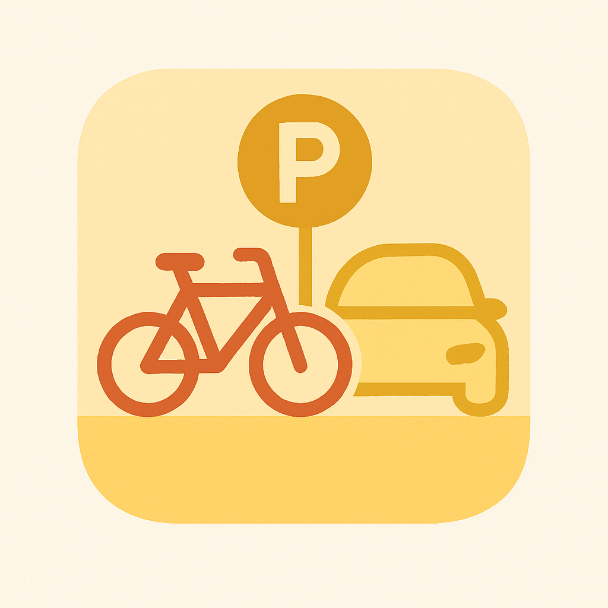

## ParkMark




This is an app to find your vehicles. You can mark your parking place and get a route to your vehicle later. You can also share the vehicles with other people.

 You can find the web app here: [parkmarkapp.netlify.app](parkmarkapp.netlify.app)

 To place it on your homescreen press the share button and then press "Add to homescreen".

 ATTENTION: The app doesn't run offline, you need internet for using it. If you delete your cache the data will be deleted.
 


### Clone the app

You can clone this app by using this command: 
```bash
git clone https://github.com/ToniDev48/ParkMark.git
```


Then you can run the app with this command:

```bash
npm run start
```

### Technologies

The app is made with Capacitor and Tailwindcss as UI Library. A few UI Components are taken from Tailwind Material.
